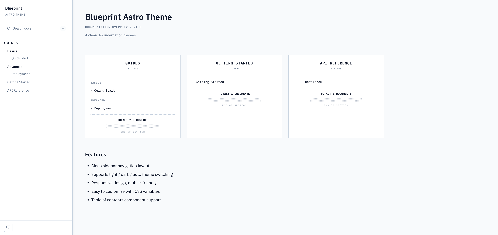

# Blueprint Astro Theme

A clean documentation theme for Astro 5, ported from Blueprint Docs.



## Quick Start

Create a new project from this template:

```bash
npm create astro@latest -- --template jaspermalik/blueprint-astro-theme
```

Then start the dev server:

```bash
cd blueprint-astro-theme
npm install
npm run dev
```

## Project Structure

```
src/
├── components/
│   ├── Sidebar.astro           # Sidebar with nested groups
│   ├── SidebarSubgroup.astro   # Recursive nested group renderer
│   ├── ThemeToggle.astro       # Theme toggle (light/dark/auto)
│   ├── BackToTop.astro         # Back to top button
│   ├── TableOfContents.astro   # TOC component
│   ├── TocGroup.astro          # Homepage card grid
│   └── Search.astro            # Pagefind search modal
├── layouts/
│   └── BaseLayout.astro        # Root layout with sidebar
├── pages/
│   ├── index.astro             # Homepage
│   ├── 404.astro               # Not found page
│   └── docs/
│       └── [...slug].astro     # Doc pages
├── styles/
│   └── global.css              # Global styles & CSS variables
├── utils/
│   └── sidebar.ts              # Auto-generate sidebar from collections
├── content.config.ts           # Content collection config
└── schema.ts                   # Reusable docs collection schema
```

## Writing Content

Place Markdown files in `src/content/docs/`. Nested folders automatically become nested sidebar groups.

```md
---
title: Getting Started
description: Optional description
order: 1
---

## Heading

Your content here...
```

### Frontmatter Fields

| Field | Type | Required | Description |
|-------|------|----------|-------------|
| `title` | `string` | Yes | Document title |
| `description` | `string` | No | Short description |
| `order` | `number` | No | Sort order within group |
| `date` | `Date` | No | Publication date |

## Sidebar Navigation

The sidebar is auto-generated from the `docs` collection using `src/utils/sidebar.ts`. Directory structure maps to nested groups:

```
src/content/docs/
├── getting-started.md
└── guides/
    └── basics/
        └── quick-start.md
```

This produces: Getting Started, Guides > Basics > Quick Start.

To customize manually, pass a `nav` array to `BaseLayout`:

```astro
---
import BaseLayout from '../layouts/BaseLayout.astro';

const nav = [
  {
    title: 'Group Name',
    items: [
      { title: 'Doc Title', href: '/docs/getting-started' },
    ],
  },
];
---

<BaseLayout title="Page" nav={nav}>
  <!-- content -->
</BaseLayout>
```

## Customizing

### CSS Variables

Override these in your own global CSS to customize the theme:

| Variable | Description | Light Default |
|----------|-------------|---------------|
| `--c-bg` | Page background | `#f8fafc` |
| `--c-canvas` | Card/content background | `#ffffff` |
| `--c-border` | Border color | `#cbd5e1` |
| `--c-text-main` | Primary text | `#0f172a` |
| `--c-text-sub` | Secondary text | `#64748b` |
| `--c-accent` | Accent/link color | `#1B365D` |
| `--c-accent-hover` | Link hover color | `#2a4a7a` |
| `--c-code-bg` | Code background | `#f1f5f9` |
| `--sidebar-width` | Sidebar width | `280px` |

Dark mode is automatically handled via `[data-theme="dark"]` overrides.

### BaseLayout Props

| Prop | Type | Default | Description |
|------|------|---------|-------------|
| `title` | `string` | **required** | Page title |
| `description` | `string` | theme description | Meta description |
| `nav` | `SidebarGroup[]` | `[]` | Sidebar navigation groups |
| `lang` | `string` | `"zh-CN"` | HTML lang attribute |

### Sidebar Props

| Prop | Type | Default |
|------|------|---------|
| `logo` | `string` | `"Blueprint"` |
| `subtitle` | `string` | `"Astro Theme"` |
| `nav` | `SidebarGroup[]` | `[]` |
| `footerText` | `string` | `""` |

### TableOfContents Props

| Prop | Type | Default |
|------|------|---------|
| `headings` | `{ depth, slug, text }[]` | `[]` |
| `title` | `string` | `"目录"` |

## Theme Features

### Search

Full-text search is powered by [Pagefind](https://pagefind.app/), integrated via `astro-pagefind`. The search modal is triggered via the icon in the sidebar (keyboard shortcut: `Cmd/Ctrl + K`).

### Theme Toggle

Three modes: `light`, `dark`, `auto`.

- Click the icon at the bottom of the sidebar to switch
- Persisted in `localStorage`
- Respects `prefers-color-scheme` when set to `auto`

### Responsive Breakpoints

| Breakpoint | Behavior |
|------------|----------|
| `< 768px` | Mobile: sidebar collapses to hamburger menu |
| `768px - 1024px` | Tablet: TOC hidden |
| `> 1024px` | Desktop: full layout with sidebar + TOC |

## Reusing as an NPM Package

The theme is also configured for consumption as an npm package. Install in an existing Astro project:

```bash
npm install blueprint-astro-theme
```

Import components and utilities:

```astro
---
import { BaseLayout, TableOfContents, generateSidebar } from 'blueprint-astro-theme';
---
```

See `package.json` exports for all available entry points.

## License

MIT
